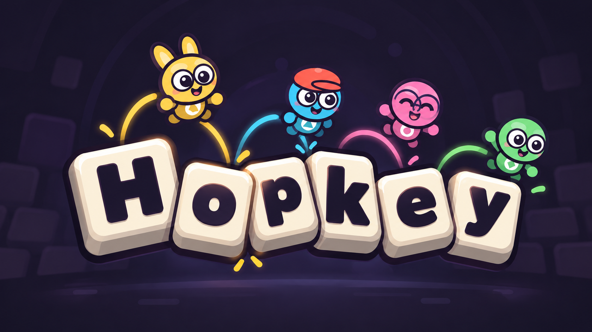

# Hopkey

Tiny critters hop across a giant keyboard, typing words by where they step —
while every key they use jams behind them.

- **Step to press.** Land on your next letter to type it.
- **Keys jam.** Leave a key and it jams for 5 seconds. Jammed keys are walls;
  jump onto one and you are out for the round.
- **Jump to save.** Keys you fly over are untouched.
- **Keep moving.** Five seconds on the same letter and it drops you.
- **Pick your start.** Everyone chooses a starting key before each round.
- **ESC warps** you to a random free key. Ten-second shared recharge.
- **ENTER together.** The whole team holds Enter for five seconds to send.
- **REVIVE.** A teammate holding REVIVE for five seconds brings you back.
- **Shift and Caps Lock** work for everyone like a real keyboard. `!` and `?`
  need someone standing on Shift.
- **Push.** Walk into someone to shove them one key, jump into them for two.
  On Enter a shove only budges you.
- **TAB** dashes you along the whole row, bowling others aside. 4-second
  recharge.
- **Perks.** PIP jumps further, DOT can stand 7 seconds, BUN has a spare
  Escape, MOSS cannot be pushed.
- **Replay.** Each round ends with a slow-motion replay of its last moments.
- **Game set-up.** The host switches add-ons on or off: golden key, combo,
  power-ups, row jams, caps storm, sabotage. Also perks, pushing, replay,
  round clock and War length.
- **CTRL (War).** Hold it for 10 seconds to scatter the other team.
- **Hopkey: WAR.** 1v1 or 2v2, two fairly matched words, one shared keyboard.

Rules: [docs/GAME_DESIGN.md](docs/GAME_DESIGN.md) · Build:
[docs/ARCHITECTURE.md](docs/ARCHITECTURE.md) · What was tested:
[docs/VERIFICATION.md](docs/VERIFICATION.md)

## Run

Godot 4.7.1 Standard, Forward+. No plugins or paid services.

    & .tools/godot-4.7.1/Godot_v4.7.1-stable_win64.exe --path .

Or open `project.godot` and press F5. After export the game is
`builds/windows/Hopkey.exe` (debug) or `builds/release/Hopkey.exe`:

    & $G --headless --path . --export-release "Windows Desktop" builds/release/Hopkey.exe

Keyboard: WASD / arrows move, Space jumps and confirms, Esc pauses.
Controller: stick / D-pad moves, A jumps and confirms, Start pauses.
One physical device drives one player. Co-op takes 2–4 (or solo practice);
War takes exactly 2 or 4.

## Play together on two PCs (desktop)

Both players run `Hopkey.exe` and choose **PLAY ONLINE**.

1. One player presses **HOST A GAME** (COPY puts the code on the clipboard). Windows may ask to allow Hopkey through
   the firewall the first time: allow it.
2. **Same Wi-Fi / LAN:** the room appears on the other PC by itself, or type
   the LAN code.
3. **Over the internet:** the host's screen shows an internet code if the
   router opened the port automatically (UPnP). If it says unavailable,
   forward **UDP port 24642** to the host PC and give your friend your public
   IP address instead.
4. The host presses **START CO-OP** or **START WAR** (War needs 2 or 4
   players in the room).

Each PC controls one critter with its own keyboard. The host's machine runs
the match. Desktop and browser players cannot join each other.

## Play in the browser

The web build keeps its room-code lobby (Convex rooms + WebRTC, co-op only);
see [deployment/README.md](deployment/README.md). The live site is still the
previously deployed version until `main` is pushed.

## Verify

    $G = ".tools/godot-4.7.1/Godot_v4.7.1-stable_win64_console.exe"
    & $G --headless --path . --editor --quit
    & $G --headless --path . --script res://tests/test_runner.gd
    & $G --path . --script res://tests/visual_smoke.gd
    & $G --path . --script res://tests/perf_probe.gd
    & $G --headless --path . --export-debug "Windows Desktop" builds/windows/Hopkey.exe

Debug builds have developer tools on F1–F12 (F1 lists them).

Controllers, audio hardware, two-computer play and group fun have not been
tested by a person. Phase 1B still requires a real playtest and approval.
